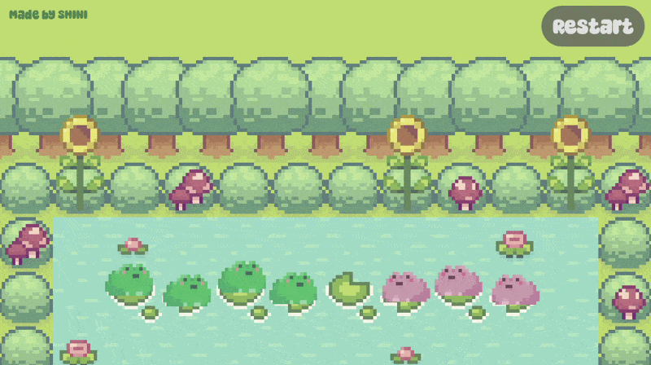
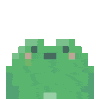
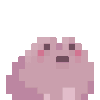

# 🐸 🌸 Green Pink Frogs 🌸 🐸

🌿 a cozy puzzle on a quiet little pond 🌿

  <!-- 🐸 MAIN ANIMATION -->
  

  ✨ hop... think... hop ✨  

---

## 🌸 About the Game

**Green Pink Frogs** is a cozy version of the classic **Frogs & Toads puzzle** 🧠🐸

Two groups of frogs sit on opposite sides of a pond...
and they need to **switch places**.

But there’s a catch 👀
they only move in *one direction* — and they don’t like turning back.

---

## 🎮 Play the Game

  💚 Play it here 🩷 
  👉 https://shinigda.itch.io/green-pink-frogs

---

## 🐸 The Frogs

  
  

  💚 Green frogs &nbsp;&nbsp;&nbsp; 🩷 Pink frogs  

---

## 🌿 Game Rules

* 💚 Green frogs move **only to the right**

* 🩷 Pink frogs move **only to the left**

* 🪷 If the next lily pad is empty → the frog **moves forward**

* 🪷 If blocked, but the next pad after is empty → the frog **jumps over**

* ❌ If no moves are possible → **you lose**

---

## 🎯 Goal

Swap all the frogs to the opposite side:

* 💚 Green frogs → reach the **right side**
* 🩷 Pink frogs → reach the **left side**

## 🛠️ Built With

* Godot Engine (HTML5 Export)

---

  🌿 thanks for visiting the pond 🌿  

  
  
  
  
  
  
  
  
  

